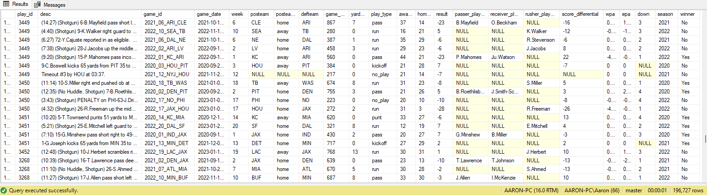

# <p align="center">NFL Play-By-Play Stats 2020-2023</p>
# <p align="center"></p>

### Using NFL play-by-play data of the past 4 seasons, I analyzed offensive strategies and tried to figure out which offenses or players were most successful, along with figuring out the different factors that could potentially determine a defenses' rankings and increase a teams' win probability.

<br>

### The following is a description of the data columns I will be using:
**Play_id**: primary key; unique for every instance in the table

**Game_id**: unique identifier for every game; displays in order the away team, home team, year

**Week**: what week the game takes place in

**Desc**: a description of the play

**Posteam/Defteam**: the team on offense/defense

**Game_date**: as a date variable, provides the day, month and year the game took place in

**Game_seconds_remaining**: how many seconds are left in the game

**Passer_player_me**: name of the quarterback involved in the play (if applicable)

**receiver_player_me**: name of the wide receiver involved in the play (if applicable)

**rusher_player_me**: name of the running back involved in the play (if applicable)

**wpa**: win-probability added; shows how much a team’s chance of winning the game changed as a results of the play

**EPA**: expected points added; advanced stat that determines how well the play was relative to the “expected points” of that play

**Posteam_type**: indicates ‘home’ if the team on offense is the home team, or ‘away’ if the team on offense is the visiting team

**Score_differential**: at the time of the play, how many points the HOME TEAM is ahead by (this value can be negative)

**Yards_gained**: how many yards were gained as a result of this play

**Home_score/away_score**: how many points the home team/away team has at the end of the game

**Result**: (Home_score) – (Away_score)

**Play_type**: play that was ran; main types are ‘pass’, ’run’, ’field_goal’, ’extra_point’, ’punt’

**Down**: is either 1, 2, 3, 4; represents what down the play took place during

<br>

### First, I needed to combine the individual datasets of each NFL season between 2020-2023 and merge them into one table:
```sql
drop table if exists nfl_pbp
    select * into nfl_pbp
    from (
        select play_id, [desc], game_id, game_date, week, posteam, posteam_type, defteam, game_seconds_remaining, yards_gained,
               play_type, away_score, home_score, result, 
               passer_player_name, receiver_player_name, rusher_player_name, score_differential, wpa, epa, down
          from play_by_play_2020

    UNION

        select play_id, [desc], game_id, game_date, week, posteam, posteam_type, defteam, game_seconds_remaining, yards_gained,
               play_type, away_score, home_score, result, 
               passer_player_name, receiver_player_name, rusher_player_name, score_differential, wpa, epa, down 
        from play_by_play_2021

    UNION

        select play_id, [desc], game_id, game_date, week, posteam, posteam_type, defteam, game_seconds_remaining, yards_gained,
               play_type, away_score, home_score, result, 
               passer_player_name, receiver_player_name, rusher_player_name, score_differential, wpa, epa, down
        from play_by_play_2022

    UNION

        select play_id, [desc], game_id, game_date, week, posteam, posteam_type, defteam, game_seconds_remaining, yards_gained,
               play_type, away_score, home_score, result, 
               passer_player_name, receiver_player_name, rusher_player_name, score_differential, wpa, epa, down
        from play_by_play_2023) as x
```
Result:


### Need to update result column since certain data did not transfer properly
```sql
update nfl_pbp
set result = home_score - away_score
```

### Add columns for season and winner
```sql
alter table nfl_pbp
add season int NULL

alter table nfl_pbp
add winner NVARCHAR(5) NULL
```

### Season column for the NFL season that starts in September and ends in February
```sql
update nfl_pbp
set season = 
    (case when month(game_date) <= 2 then year(game_date) - 1 else year(game_date) end)
```

### Winner column for whether the team on offense ends up winning the game
```sql
update nfl_pbp
set winner = 
    (case when posteam_type = 'away' 
        then 
            (case when result < 0 then 'Yes'			-- away team on offense won
                  when result > 0 then 'No' 
				  else 'Tied' 
            end) 
        else 
            (case when result > 0 then 'Yes'			-- home team on offense won
                  when result < 0 then 'No' 
				  else 'Tied' 
            end) 
    end)
```

### How many pass plays and run plays were recorded?
```sql
select count(*) from nfl_pbp
where play_type in ('pass','run')
```

### WPA stands for Win Probability Added
### Find top 20 plays by most WPA in regular season
```sql
select top 20 game_id, posteam, season, [desc], wpa
from nfl_pbp
where play_type not in ('field_goal', 'punt', 'no_play', 'extra_point') and week <= 18
order by wpa desc
```

### Find top 20 plays by most WPA in playoffs
```sql
select top 20 game_id, posteam, season, [desc], wpa
from nfl_pbp
where play_type not in ('field_goal', 'punt', 'no_play', 'extra_point') and week > 18
order by wpa desc
```

### Determine top 20 best QBs by EPA per play within a regular season (Quarterbacks with at least 200 plays)
```sql
select top 20 passer_player_name, season, avg(epa) as 'EPA per play' from nfl_pbp
where passer_player_name is not null and play_type = 'pass' and week <= 18 
group by passer_player_name, season
having count(*) >= 200
order by sum(epa) / count(*) desc
```

### Determine top 20 best WRs by EPA per play within a regular season (Wide Receivers with at least 75 plays)
```sql
select top 20 receiver_player_name, season, avg(epa) as 'EPA per play' from nfl_pbp
where receiver_player_name is not null and week <= 18
group by receiver_player_name, season
having count(*) >= 75
order by sum(epa) / count(*) desc
```

### Determine top 20 best RBs by EPA per play within a regular season (Runningbacks with at least 200 plays)
```sql
select top 20 rusher_player_name, season, avg(epa) as 'EPA per play' from nfl_pbp
where rusher_player_name is not null and week <= 18
group by rusher_player_name, season
having count(*) >= 200
order by avg(epa) desc
```

### DEFENSE: Multiple factors help determine the rankings of teams and how good their defense is
### -- 1. Which defenses forced the most turnovers?
### -- 2. Which defenses forced the most negative plays or plays with no yards gained?
### -- 3. Which defenses allowed the fewest points per game?
### -- 4. Which defenses allowed the fewest yards per play?
### -- 5. Determine the best defenses based on all four factors
```sql
select defteam, season, 
rank() over (order by sum(case when [desc] LIKE '%INTERCEPTED%' or [desc] LIKE '%FUMBLE%' then 1.0 else 0.0 end) / count(*) desc) as 'Turnover Rank',
rank() over (order by sum(case when [desc] like '%incomplete%' or yards_gained <= 0 and defteam is not null and play_type in ('pass','run')  then 1.0 else 0.0 end) / count(*) desc) as 'Dead Play Rank',
rank() over (order by sum(case when posteam_type = 'home' then home_score else away_score end)*1.0 / count(*)) as 'Scoring Rank',
rank() over (order by sum(yards_gained) * 1.0 / count(*)) as 'Yards Allowed Rank',
rank() over(order by (sum(case when [desc] LIKE '%INTERCEPTED%' or [desc] LIKE '%FUMBLE%' then 1.0 else 0.0 end) / count(*) ) +
                     (sum(case when [desc] like '%incomplete%' or yards_gained <= 0 and defteam is not null and play_type in ('pass','run')  then 1.0 else 0.0 end) / count(*) ) +
                      sum(case when posteam_type = 'home' then home_score else away_score end)*1.0 / count(*) +
                      sum(yards_gained) * 1.0 / count(*))  as '(Averaged) Total Defense Rank'
from nfl_pbp
where play_type in ('run','pass') and week <= 18
group by defteam, season
order by [(Averaged) Total Defense Rank] 
```
